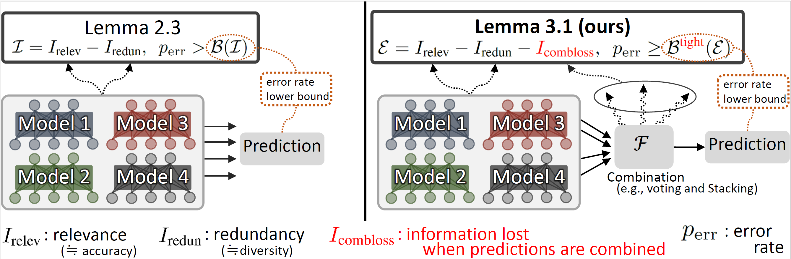

# Ensemble Metrics


This is the official codebase for the paper [Rethinking Fano's Inequality in Ensemble Learning](https://arxiv.org/abs/2205.12683) (ICML2022).

## What's good?
* 👊 The paper answers the fundamental question in ensemble learning: **What factors make an ensemble method good or bad?**
* 👊 Specifically, our theory evaluates an ensemble method by a well-grounded set of metrics:
    * relevance  (≒accuracy)
    * redundancy (≒diversity)
    * combination loss (≒information lost when model predictions are combined to make a final prediction)
* 😀 **Therefore, one can use the three metrics to analyze an ensemble method, e.g., claim that the one's own proposed method is better than the previous one on the basis of a metric.**
    - We demonstrated such analysis in Section 6 of our paper.

For details of the theory, please refer to the paper or [our blog post](https://www.hitachi.com/rd/sc/aiblog/202209_theoretical-framework-of-el/index.html)

## Installation
```console
$ git clone https://github.com/hitachi-nlp/ensemble-metrics.git
$ cd ensemble-metrics
$ pip install -e .
```

## How to use
Basically,
```python
from ensemble_metrics import compute_metrics

metrics = compute_metrics(
    labels,
    base_model_preds,
    ensemble_preds,
    p0=0.2,  # approximate error rate, should be an error rate of a base model.
)

print(metrics.relevance)
print(metrics.redundancy)
print(metrics.combloss)
```

See [a working example](./test/test_toy_example.py) for details.

## Other materials (Japanese only)
* [日経ロボティクス2023/2月号: アンサンブル学習はどうすれば性能アップできるのか、日立製作所が実務に役立つ新理論を提唱](https://xtech.nikkei.com/atcl/nxt/mag/rob/18/012600001/00114/)
* [人工知能学会2023: ランチョンセミナー「アンサンブル学習における基礎理論の構築」](https://speakerdeck.com/morishtr/ren-gong-zhi-neng-xue-hui-2023rantiyonsemina-ansanburuxue-xi-niokeruji-chu-li-lun-nogou-zhu)

## Contact
For any reason where a GitHub pull request or an issue is not appropriate, feel free to email terufumi.morishita.wp[at]hitachi.com.

## Citation
Please cite our paper as:
```
@InProceedings{pmlr-v162-morishita22a,
  title = 	 {Rethinking Fano’s Inequality in Ensemble Learning},
  author =       {Morishita, Terufumi and Morio, Gaku and Horiguchi, Shota and Ozaki, Hiroaki and Nukaga, Nobuo},
  booktitle = 	 {Proceedings of the 39th International Conference on Machine Learning},
  pages = 	 {15976--16016},
  year = 	 {2022},
  editor = 	 {Chaudhuri, Kamalika and Jegelka, Stefanie and Song, Le and Szepesvari, Csaba and Niu, Gang and Sabato, Sivan},
  volume = 	 {162},
  series = 	 {Proceedings of Machine Learning Research},
  month = 	 {17--23 Jul},
  publisher =    {PMLR},
  pdf = 	 {https://proceedings.mlr.press/v162/morishita22a/morishita22a.pdf},
  url = 	 {https://proceedings.mlr.press/v162/morishita22a.html}
}
```
